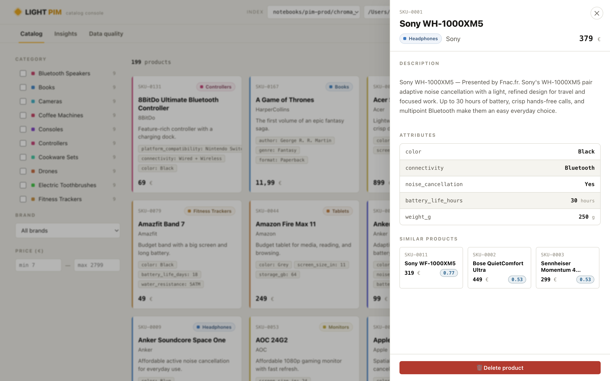

# Light PIM — catalog visualizer

A small **Product Information Management** UI for the TD5 catalog. It reads the
products stored in a **ChromaDB** index and lets you browse them, inspect every
attribute, search the catalog **semantically** (same vectors your agent uses),
see **similar products**, check **data quality**, and **delete** entries.

Use it as a companion to your TD5 copilot: point it at the same `chroma_index`
your chatbot writes to and watch products you add appear here.



## Run

```bash
cd notebooks/pim-prod
pip install -r app/requirements.txt
uvicorn app.main:app --reload --app-dir .
# open http://localhost:8000
```

That single process serves both the JSON API (`/api/*`) and the web UI (`/`).
The first semantic search is a little slow — it lazily loads the MiniLM
embedding model — then it's fast.

## Choosing which index to read

The UI starts on the **TD4 mini-project catalog**
(`../TD4_mcp/mini_project_solution/chroma_index`) — the store your TD5 copilot
writes to. (Override the startup folder with `PIM_INDEX_DIR=…`; see below.) Use
the **Index** picker in the header to switch to any other `chroma_index` folder:

- pick one from the dropdown (folders auto-discovered in the repo), or
- type/paste a path and click **Load**.

To make your copilot's additions show up, point the picker at the same folder your
TD5 MCP server uses as its store (or start the UI there with
`PIM_INDEX_DIR=/path/to/chroma_index uvicorn app.main:app --app-dir .`).

## What's inside

The product catalog (the ChromaDB index) is **not** bundled here — it lives with
whichever mini-project writes it (by default the TD4 one above) and is a
regenerable build artifact.

```
pim-prod/
├── app/                 # FastAPI backend
│   ├── main.py          #   API routes + serves the frontend
│   ├── catalog.py       #   ChromaDB access (switchable index, search, similar)
│   └── requirements.txt
└── web/                 # Vue 3 frontend (no build step — vendored Vue)
    ├── index.html · app.js · styles.css
    └── vendor/vue.global.prod.js
```

### Views

- **Catalog** — filter by category / brand / price, sort, and switch the search
  box between *Filter* (substring) and *Semantic* (vector similarity, with a
  relevance score). Click a card for the full detail drawer.
- **Detail drawer** — the embedded description, the complete attribute table
  (attributes the category expects but the product lacks are flagged as missing;
  attributes present but *not* in the category's PIM schema are tagged
  `not in schema`), an **Extra metadata** section listing off-model record fields
  (not part of the PIM structure, but available to enrich the product later), a
  *Similar products* strip (nearest neighbours by embedding), and **Delete**.
- **Insights** — products per category, price distribution, top brands.
- **Data quality** — attribute-completeness per category and the list of
  products missing attributes (click to fix).

## API (handy for the notebook / debugging)

| Method | Route | |
|---|---|---|
| GET | `/api/products` | all products |
| GET | `/api/products/{sku}` | one product + expected/missing attributes |
| DELETE | `/api/products/{sku}` | delete a product |
| GET | `/api/products/{sku}/similar?k=5` | nearest neighbours |
| POST | `/api/search` `{query, k}` | semantic search |
| GET | `/api/stats` · `/api/quality` · `/api/categories` | aggregates / schema |
| GET/POST | `/api/index` | read / switch the active `chroma_index` folder |

## Notes

- **Deletes are permanent** for the index you're pointed at (there's a confirm
  step). To rebuild the catalog, re-run the writing mini-project's index builder
  (e.g. the TD4 `build_index.py`), which regenerates it from
  `notebooks/data/products.csv`. (The index is gitignored, so there's nothing to
  `git checkout`.)
- No API key needed — this app only reads/deletes the vector store; it never
  calls an LLM. Adding products is the copilot's job.
- The embedding model is `all-MiniLM-L6-v2`, the same one used across TD1→TD5, so
  the UI and your agent share one vector space.
